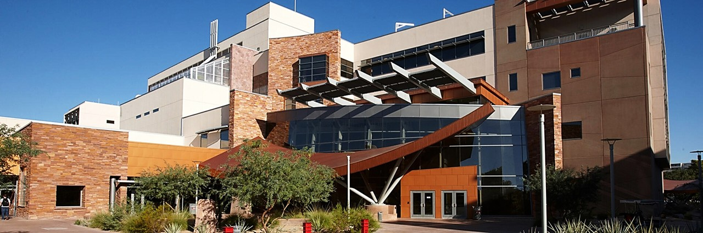

# UNLV MR Imaging Core (UMIC)

**UNLV's hub for advanced brain imaging and interdisciplinary research using MR technology.**

Welcome to the UNLV MR Imaging Core documentation site. This site serves as the central hub for researchers seeking access to UNLV’s MR and fMRI. Whether you are a new or returning user, this resource is designed to help ensure safe, compliant, and successful use of the UNLV MR and fMRI.

---
## Start Here

<a class="card" href="getting-started.md">
<h3>New Users</h3>

Learn how to get started with the facility

</a>

<a class="card" href="training.md">
<h3>Training</h3>

Complete required training and certification

</a>

<a class="card" href="safety.md">
<h3>Safety</h3>

Review MRI safety guidelines and procedures

</a>

---

## Key Resources

<a class="card" href="policies.md">
<h3>Policies</h3>

Review usage policies and guidelines

</a>

<a class="card" href="user-docs.md">
<h3>User Documentation</h3>

Access guides and procedures

</a>

---

## Need Help

<a class="card" href="contact.md">
<h3>Contact & Directions</h3>

Get help and find the facility

</a>

---

## About UMIC

The UNLV MR Imaging Core supports research and training in MRI and fMRI.