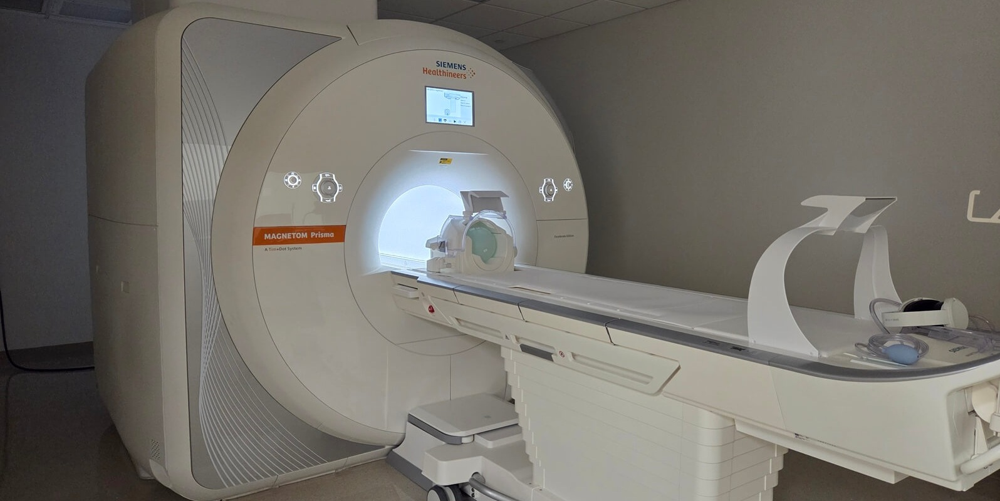

To support comprehensive clinical research, UMIC offers on-site phlebotomy services for research participants. This allows for the collection of blood samples, including biomarkers, conveniently integrated with your imaging session. Our phlebotomy room is located in SEB-1232 within Zone 2 of the UMIC.

---
